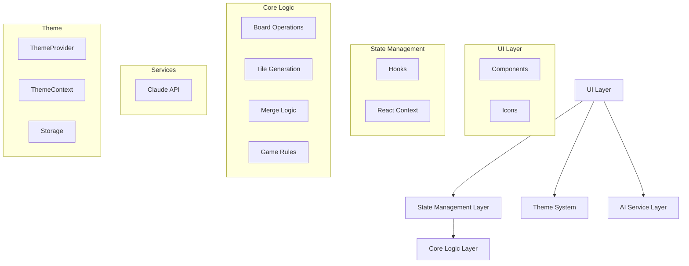
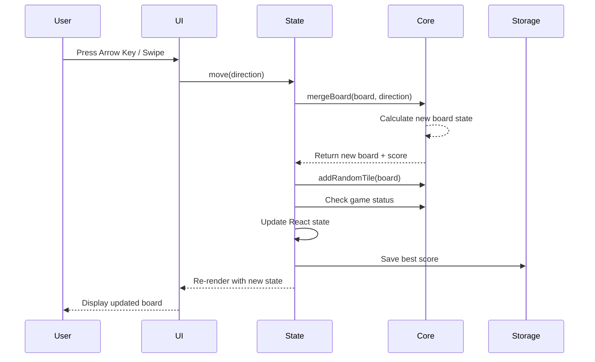

# 2048 Game

A modern implementation of the classic 2048 puzzle game built with React, TypeScript, and Tailwind CSS. Features AI-powered move suggestions using Claude API, multiple board sizes, and a beautiful dark mode.

## 🎮 Live Demo

[Play the game here](https://game2048-rouge.vercel.app/)

## ✨ Features

- 🎯 Classic 2048 gameplay with smooth animations
- 📐 Multiple board sizes: 4×4, 5×5, and 6×6
- 🏆 Victory modal with continue playing option
- 🤖 AI-powered move suggestions with smart fallback (Claude → Grok → Local)
- 🌓 Dark mode with system preference detection
- 💾 LocalStorage persistence for theme preference and best score
- ⌨️ Keyboard controls (arrow keys)
- 👆 Touch/swipe controls for mobile devices
- 📱 Responsive design (desktop and mobile optimized)
- ♿ Accessible UI with ARIA labels

## 🏗️ Architecture

This project follows a clean, layered architecture with clear separation of concerns:



## 📁 Project Structure

```
src/
├── core/                      # Core game logic (pure functions)
│   ├── types.ts              # Type definitions and enums
│   ├── constants.ts          # Game constants
│   ├── index.ts              # Unified exports
│   ├── board/                # Board-related operations
│   │   ├── boardFactory.ts   # Board initialization
│   │   ├── boardQuery.ts     # Board state queries
│   │   └── boardTransform.ts # Board transformations (rotation)
│   ├── tile/                 # Tile operations
│   │   └── tileGenerator.ts  # Random tile generation
│   └── merge/                # Merge logic
│       ├── lineMerger.ts     # Single line merge algorithm
│       └── boardMerger.ts    # Board-wide merge operations
│
├── hooks/                     # React hooks for state management
│   ├── useGameState.ts       # Main game state and actions
│   ├── useKeyboard.ts        # Keyboard event handling
│   └── useSwipe.ts           # Touch/swipe gesture handling
│
├── services/                  # AI services
│   ├── aiService.ts          # Main AI service with provider chain
│   ├── localAI.ts            # Local Expectimax AI algorithm
│   └── providers/            # AI provider implementations
│       ├── types.ts          # Provider interface and shared utilities
│       ├── ClaudeProvider.ts # Anthropic Claude integration
│       ├── GrokProvider.ts   # xAI Grok integration
│       └── LocalProvider.ts  # Local AI adapter
│
├── config/                    # Configuration
│   └── boardConfig.ts        # Board size configurations
│
├── storage/                   # Local storage utilities
│   └── bestScoreStorage.ts   # Best score persistence
│
├── theme/                     # Theme system (dark/light mode)
│   ├── types.ts              # Theme types and constants
│   ├── storage.ts            # LocalStorage utilities
│   ├── ThemeContext.tsx      # React Context and hook
│   ├── ThemeProvider.tsx     # Theme provider component
│   ├── ThemeToggle.tsx       # Toggle button component
│   └── index.ts              # Unified exports
│
├── components/                # React UI components
│   ├── Game.tsx              # Main game container
│   ├── Board.tsx             # Responsive game board (desktop + mobile)
│   ├── Tile.tsx              # Individual tile component
│   ├── ScoreBoard.tsx        # Score display
│   ├── BoardSizeSelector.tsx # Board size selection dropdown
│   ├── VictoryModal.tsx      # Victory dialog with overlay
│   ├── Toast.tsx             # Notification toast
│   ├── AIHintButton.tsx      # Compact AI hint button
│   └── icons.ts              # Centralized icon exports
│
├── App.tsx                    # Root application component
├── main.tsx                   # Application entry point
└── index.css                  # Global styles and Tailwind config
```

## 🎯 Layer Responsibilities

### 1. Core Logic Layer (`src/core/`)

**Purpose**: Pure, framework-agnostic game logic

**Responsibilities**:
- Board state management and transformations
- Tile generation and placement
- Merge algorithms for all directions
- Game state validation (win/lose conditions)
- Board queries (empty cells, adjacent tiles, etc.)

**Key Principles**:
- Pure functions only (no side effects)
- Fully testable in isolation
- No UI or framework dependencies
- Single Responsibility Principle

**Sub-modules**:
- `board/`: Board creation, queries, and transformations
- `tile/`: Tile generation logic
- `merge/`: Line and board merge algorithms

### 2. State Management Layer (`src/hooks/`)

**Purpose**: React state management and business logic orchestration

**Responsibilities**:
- Game state (board, score, status)
- User action handling (move, restart, continue)
- State persistence (best score)
- Event handling (keyboard inputs, touch gestures)

**Communication**:
- **From UI**: Receives user actions via hook methods
- **To Core**: Calls pure functions from core layer
- **To UI**: Provides state via React hooks

### 3. Services Layer (`src/services/`)

**Purpose**: AI service integrations with provider abstraction

**Responsibilities**:
- Multiple AI provider support (Claude, Grok, Local)
- Smart fallback chain (tries providers in priority order)
- Prompt engineering for optimal suggestions
- Error handling and automatic fallback
- Response validation

**Architecture**:
- Strategy Pattern: Each AI provider implements a common interface
- Chain of Responsibility: Tries providers sequentially until one succeeds
- Open-Closed Principle: Easy to add new providers without modifying existing code

### 4. Theme System (`src/theme/`)

**Purpose**: Centralized theme management

**Responsibilities**:
- Dark/light mode switching
- System preference detection
- LocalStorage persistence
- Theme context provision

**Features**:
- Automatic system theme detection
- User preference persistence
- Smooth transitions
- Accessibility support

### 5. UI Layer (`src/components/`)

**Purpose**: Visual presentation and user interaction

**Responsibilities**:
- Rendering game state
- User input capture (keyboard, touch)
- Visual feedback and animations
- Accessibility features

**Key Components**:
- `Game`: Main container, layout orchestration
- `Board`: Responsive grid layout (desktop and mobile versions)
- `Tile`: Individual tile with dynamic sizing and color mapping
- `ScoreBoard`: Unified score display (current + best)
- `VictoryModal`: Modal dialog for game completion
- `BoardSizeSelector`: Dropdown for board size selection
- `AIHintButton`: Compact AI suggestion button

## 🔄 Data Flow



## 🚀 Getting Started

### Prerequisites

- Node.js 18+
- npm or yarn
- (Optional) Anthropic Claude API key or Grok API key for AI features
  - Without API keys, the app will use local AI algorithm

### Installation

1. Clone the repository:
```bash
git clone https://github.com/yourusername/game2048.git
cd game2048
```

2. Install dependencies:
```bash
npm install
```

3. Create a `.env` file (optional, for AI features):
```env
# Option 1: Use Claude AI (highest quality)
VITE_ANTHROPIC_API_KEY=your_claude_api_key_here

# Option 2: Use Grok AI (high quality)
VITE_GROK_API_KEY=your_grok_api_key_here

# Note: If both keys are provided, Claude will be used first.
# If neither is provided, local AI algorithm will be used.
```

4. Start the development server:
```bash
npm run dev
```

5. Open http://localhost:5173 in your browser

### Build for Production

```bash
npm run build
npm run preview
```

### Run Tests

```bash
npm test              # Run tests in watch mode
npm run test:coverage # Run with coverage report
```

## 🎮 How to Play

### Basic Rules

1. Use **arrow keys** (desktop) or **swipe** (mobile) to move tiles
2. When two tiles with the same number touch, they **merge into one**
3. Reach the winning tile to complete the game
4. The game ends when no moves are possible

### Board Sizes

Choose your difficulty level:
- **4×4 Classic**: Reach **16** (fast testing mode)
- **5×5 Medium**: Reach **4096** (moderate challenge)
- **6×6 Hard**: Reach **8192** (expert level)

### Victory Options

When you win, a modal appears with two choices:
- **Continue Playing**: Keep going for a higher score
- **New Game**: Start fresh with a new board

### AI Assistant

Click the **✨ AI Hint** button to get intelligent move suggestions. The app uses a smart fallback system:

1. **Claude AI** (if API key provided) - Highest quality, powered by Anthropic
2. **Grok AI** (if API key provided) - High quality, powered by xAI
3. **Local Expectimax AI** (always available) - Good quality, runs locally

The AI analyzes the current board and suggests the optimal move to:
- Avoid game over
- Maximize score
- Increase chances of winning

## 🛠️ Tech Stack

- **Frontend**: React 18 + TypeScript
- **Styling**: Tailwind CSS v4
- **Build Tool**: Vite
- **Icons**: Lucide React
- **AI**: Anthropic Claude API
- **Testing**: Vitest + React Testing Library
- **Deployment**: Vercel

## 📦 Key Dependencies

```json
{
  "react": "^18.3.1",
  "typescript": "~5.6.2",
  "tailwindcss": "^4.1.14",
  "@tailwindcss/postcss": "^4.1.14",
  "@anthropic-ai/sdk": "^0.65.0",
  "lucide-react": "^0.544.0",
  "vite": "^5.4.10",
  "vitest": "^3.2.4"
}
```

## 🎨 Design Principles

### Clean Code
- Single Responsibility Principle
- Pure functions for game logic
- Clear separation of concerns
- Meaningful naming conventions

### Modularity
- Each module has a single, well-defined purpose
- Loose coupling between layers
- High cohesion within modules
- Easy to test and maintain

### Accessibility
- ARIA labels for interactive elements
- Keyboard navigation support
- Touch/swipe gesture support
- High contrast color schemes
- Screen reader friendly

### Responsive Design
- Desktop-optimized board (larger tiles)
- Mobile-optimized board (smaller tiles)
- Adaptive layout based on screen size
- Touch-friendly controls

## 🌙 Dark Mode

The app supports dark mode with:
- Automatic system preference detection
- Manual toggle via button
- LocalStorage persistence
- Smooth transitions
- Optimized colors for both themes

## 🧪 Testing

The project includes comprehensive test coverage:
- **231 tests** across 20 test files
- Unit tests for core logic
- Component tests with React Testing Library
- Integration tests for game flows
- 100% test pass rate

Run tests with:
```bash
npm test              # Watch mode
npm run test:ui       # UI mode
npm run test:coverage # Coverage report
```

## 📝 License

MIT License - feel free to use this project for learning or personal use.

## 🤝 Contributing

Contributions are welcome! Please feel free to submit a Pull Request.

## 🙏 Acknowledgments

- Original 2048 game by Gabriele Cirulli
- Claude AI by Anthropic
- Icons by Lucide

---

Built with ❤️ using React, TypeScript, and Tailwind CSS
